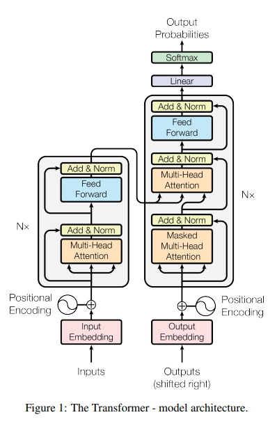

# Transformer

2017년 구글 연구팀이 NIPS에 공개한 딥러닝 아키텍처 [(논문)](https://arxiv.org/pdf/1706.03762.pdf)

Positional Encoding, (Masked) Multi-Head Attention, Self-Attention 등의 개념들이 등장

먼저 구조를 살펴보자

## 1. Architecture

구조는 크게 왼쪽의 **Encoder**와 오른쪽의 **Decoder **부분으로 나뉜다.

- ``Encoder``

  - **N개의 동일한 layer**로 구성 (논문에서는 N=6)

  - 2개의 sub-layers를 가짐
    - 첫번째 sub-layer는 muti-head **self-attention**을 사용

    - 두번째 sub-layer는 position-wise FFN를 사용

  - 각각의 sub-layer의 output에 residual connection과 normalization을 사용
- ``Decoder``

  - N개의 동일한 layer로 구성 (Encoder와 마찬가지로 N=6)
  - 3개의 sub-layer를 가짐
  
    - 2개의 sub-layer는 Encoder와 같음
    - **Masked** multi-head attention을 수행하는 sub-layer가 추가
      => To prevent positions from attending to subsequent positions.
      => (Masking은 모델이 i번째 단어를 예측할때 i 이전 단어들의 output들만 예측에 사용하기위해 쓰임) ()
    

문장 내 단어들의 순서 정보를 알려주기위해 positional encoding 사용
